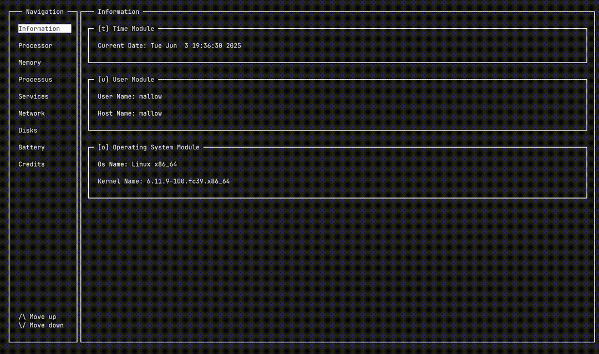

# 🖥️ MyGKrellm - System Monitor

A modern C++ implementation of the classic GKrellM system monitor, providing real-time system information through both graphical and text-based interfaces. Built as part of the EPITECH Rush 3 project, this system monitoring tool offers comprehensive insights into your system's performance and status.

## 🎯 Project Overview

MyGKrellm is a cross-platform system monitor that displays real-time information about various system components including CPU usage, memory consumption, disk space, network activity, running processes, and system services. The application supports dual display modes: a modern SFML-based graphical interface and a terminal-based ncurses interface.

## ✨ Features

- **🖼️ Dual Interface Support**: Choose between graphical (SFML) and text-based (ncurses) displays
- **📊 CPU Monitoring**: Real-time CPU usage statistics for all cores
- **💾 Memory Tracking**: Monitor RAM and swap memory usage
- **💿 Disk Management**: Track disk space usage across all mounted filesystems
- **🌐 Network Activity**: Monitor network upload/download statistics
- **⚡ Process Management**: View running processes with PID information
- **🔧 Service Monitoring**: Track system service status
- **🔋 Battery Status**: Monitor battery levels on supported systems
- **👤 User Information**: Display current user and hostname
- **🕒 Time Display**: Real-time clock with date information
- **🖥️ OS Information**: System and kernel version details

## 📸 Gallery

### Graphical Interface (SFML)


### Text Interface (ncurses)


## 🔧 Dependencies

### Build Dependencies
- **C++20 compatible compiler** (GCC 10+ recommended)
- **Make** build system
- **SFML 2.5+** (Simple and Fast Multimedia Library)
  - libsfml-graphics
  - libsfml-window
  - libsfml-system
- **ncurses** library for terminal interface

### Runtime Dependencies
- Linux-based operating system
- Access to `/proc` filesystem for system information

## 🚀 Installation

### Ubuntu/Debian
```bash
# Install dependencies
sudo apt update
sudo apt install build-essential libsfml-dev libncurses5-dev

# Clone the repository
git clone <repository-url>
cd gkrellm

# Build the project
make
```

### Arch Linux
```bash
# Install dependencies
sudo pacman -S base-devel sfml ncurses

# Clone and build
git clone <repository-url>
cd gkrellm
make
```

### General Build Instructions
```bash
# Ensure you have g++, SFML, and ncurses installed
make all
```

## 🎮 Usage

### Basic Usage
```bash
# Run in graphical mode
./MyGKrellm --graphical
./MyGKrellm -g

# Run in text mode
./MyGKrellm --text
./MyGKrellm -t

# Display help
./MyGKrellm --help
./MyGKrellm -h
```

### Command Line Options
- `--graphical` / `-g`: Launch the SFML-based graphical interface
- `--text` / `-t`: Launch the ncurses-based text interface
- `--help` / `-h`: Display usage information and available options

## 🏗️ Build Instructions

### Development Build
```bash
# Clean build
make clean
make all

# Full rebuild
make re
```

### Build Targets
- `make all`: Build the main executable
- `make clean`: Remove object files and temporary build artifacts
- `make fclean`: Remove all generated files including the executable
- `make re`: Full clean rebuild

### Compiler Flags
The project uses strict compilation settings:
- `-std=c++20`: C++20 standard compliance
- `-Wall -Wextra -Werror`: Enhanced warning detection with warnings as errors

## 🧩 Modules Architecture

The application is built using a modular architecture with the following components:

### Core Interfaces
- **`IMonitorModule`**: Base interface for all monitoring modules
- **`IMonitorDisplay`**: Abstract display interface for UI implementations

### Monitoring Modules
- **`UserModule`**: User and hostname information
- **`TimeModule`**: Current date and time
- **`OsModule`**: Operating system and kernel information
- **`CpuModule`**: CPU usage and core statistics
- **`MemoryModule`**: RAM and swap memory monitoring
- **`DiskModule`**: Filesystem usage statistics
- **`NetworkModule`**: Network interface statistics
- **`ProcessModule`**: Running processes information
- **`ServiceModule`**: System services status
- **`BatteryModule`**: Battery level monitoring

### Display Implementations
- **`GraphicalMonitor`**: SFML-based graphical interface
- **`TextMonitor`**: ncurses-based terminal interface

## 📄 License

This project is licensed under the MIT License. See [LICENSE.md](LICENSE.md) for the full license text.

```
MIT License
Copyright (c) 2025 TekyoDrift
```

## 🤝 Contributing

We welcome contributions to MyGKrellm! Please read our [Contributing Guidelines](CONTRIBUTING.md) and [Code of Conduct](CODE_OF_CONDUCT.md) before submitting pull requests.

### How to Contribute
1. Fork the repository
2. Create a feature branch (`git checkout -b feature/amazing-feature`)
3. Commit your changes (`git commit -m 'Add amazing feature'`)
4. Push to the branch (`git push origin feature/amazing-feature`)
5. Open a Pull Request

## 👥 Authors

- **Mallory SCOTTON** - Lead Developer
- **Hugo CATHELAIN** - Core Developer
- **Ossan Msoili** - System Modules Developer
- **Nathan Fievet** - UI Developer

## 📧 Contact

For questions, suggestions, or support, please contact:
**mscotton.pro@gmail.com**

---

<div align="center">

**🎉 Coded with ❤️ by the TekyoDrift team**

*Built during EPITECH Rush 3 • Making system monitoring beautiful and accessible*

</div>
